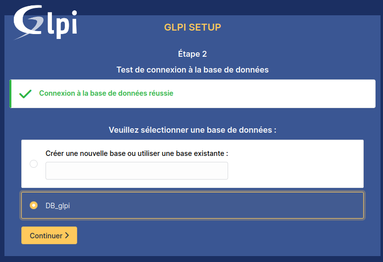
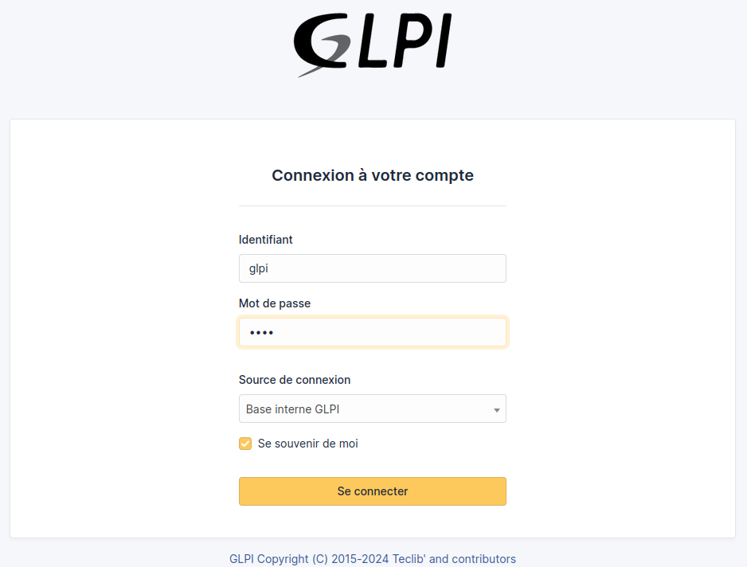

## Prérequis

:::success
Avant de procéder à l'installation de GLPI, il est important de vérifier certains prérequis. Pour que GLPI fonctionne correctement, vous aurez besoin : 

* Un serveur web (Apache)
* PHP (Pour les extension fiez vous a ce guide)
* Une base de données (MariaDB/MySQL)

Dans un environnement Linux, cela se traduit généralement par la mise en place **d'un environnement LAMP**.


Si vous possédez déjà un serveur LAMP, vous pouvez passer à l'étape suivante de l'installation sinon veuillez vous référer au **[guide suivant](../Serveurs/Serveur%20LAMP.md)** pour vous aider à l'installer.

:::danger
**Remarque :** La base de données peut être installée sur un serveur distinct en fonction de vos besoins.
:::

## Introduction à GLPI

Lors du développement d’une entreprise, le nombre de postes clients augmente considérablement, rendant la gestion du parc informatique de plus en plus complexe. Pour mieux anticiper et résoudre les problèmes liés à l’exploitation de ces systèmes, il est crucial de créer un inventaire complet des matériels utilisés. C'est là qu'intervient **GLPI** (Gestionnaire Libre de Parc Informatique).

GLPI est un logiciel libre de gestion de services d’assistance et de services informatiques (ITSM) sous licence GPL. Il aide les entreprises à visualiser et gérer leurs systèmes d’information de manière complète et efficace. GLPI permet de créer un inventaire détaillé de toutes les ressources de l’organisation, tout en facilitant la gestion des opérations administratives et financières.

Développé en 2003, GLPI a su s’imposer comme l'une des solutions open source les plus appréciées dans le domaine de la gestion des parcs informatiques, notamment pour l’helpdesk. Le logiciel est le fruit d'un projet communautaire administré par l’association INDEPNET, qui a permis d'établir un écosystème de partenaires pour soutenir son développement. En 2009, Teclib' a intégré GLPI, améliorant son code et ajoutant de nouvelles fonctionnalités, ce qui a conduit à une gestion plus efficace de son évolution.

#### Principales fonctionnalités de GLPI

Aujourd'hui, GLPI constitue l’une des meilleures solutions de gestion de services informatiques sur le marché. Voici quelques-unes de ses fonctionnalités les plus intéressantes :

- **Gestion multi-entité** : Permet de gérer plusieurs organisations au sein d'une seule instance de GLPI.
- **Support multilingue** : Accessible en plus de 45 langues.
- **Système d’authentification multiple** : Gère différents utilisateurs avec des permissions personnalisées.
- **Gestion des tickets** : Les utilisateurs peuvent facilement soumettre des demandes d'assistance via une interface intuitive.
- **Rapports d’assistance et d’actifs** : Génère des rapports détaillés sur les demandes, les actifs et les interventions.
- **Gestion des licences** : Conforme aux bonnes pratiques ITIL pour une gestion efficace des licences.
- **Plugins complémentaires** : Permettent d'étendre les fonctionnalités de base, y compris l'intégration avec des systèmes de monitoring.

GLPI s'adresse à des parcs informatiques de toutes tailles, qu'ils soient grands, moyens ou petits. Grâce à son interface claire et intuitive, ce logiciel est conçu pour être utilisé par des professionnels de l'IT comme par des utilisateurs finaux.

## Installtion  et configuration de GLPI sur Debian 

:::danger
Privilèges Administrateur Requis !

Les installations et manipulations décrites dans ce guide ont été effectuées avec des privilèges root.

Sur une distribution Debian, pour passer en mode administrateur et obtenir les privilèges root, exécutez la commande suivante :

```bash
su -
```
:::

Mise à jour des paquets sur la machine Debian : 

```bash
apt-get update && sudo apt-get upgrade
```

### Installation des extension PHP nécessaire pour GLPI


```bash
apt-get install php-xml php-common php-json php-mysql php-mbstring php-curl php-gd php-intl php-zip php-bz2 php-imap php-apcu php-xmlrpc
```

:::info
**Optionnel :** Si vous prévoyez d'intégrer GLPI avec un annuaire LDAP comme Active Directory, vous devrez installer l'extension LDAP pour PHP. Ce n'est pas nécessaire pour l'installation de base et peut être fait plus tard si besoin.

Pour installer l'extension LDAP pour PHP, exécutez la commande suivante :

```bash
apt-get install php-ldap
```
:::

### Creation d'une base de données pour GLPI

Connexion a MariaDB : 

```bash
mysql -u root -p
```
Création d'un utilisateur : 

```sql
CREATE USER 'glpi_adm'@'localhost' IDENTIFIED BY 'root';
```


Creation d'une base données nommé DB_glpi: 

```sql
CREATE DATABASE DB_glpi;
```

Accord des privilèges sur la nouvelle base de données à l'utilisateur:
```sql
GRANT ALL PRIVILEGES ON DB_glpi.* TO glpi_adm@localhost;
```
Accorde tous les privilèges sur la base de données `DB_glpi` à l'utilisateur `glpi_adm`
qui se connecte depuis `localhost`.

:::info
Accordez les privilèges à l'utilisateur pour permettre les connexions à distance : 

```sql
CREATE USER 'glpi_adm'@'%' IDENTIFIED BY 'password';
```

```sql
GRANT ALL PRIVILEGES ON DB_glpi.* TO 'glpi_adm'@'%';
```

Note : Utilisez '%' pour permettre les connexions depuis n'importe quelle adresse IP. Pour restreindre l'accès à une adresse IP spécifique, remplacez '%' par l'adresse IP du client.

:::

Appliquer les modifications des privilèges :

```sql
FLUSH PRIVILEGES;
```

Quitter MariaDB :

```sql
EXIT;
```

### Commandes Indispensables pour Gérer une Base de Données et ses Utilisateurs

| Commande                          | Description                                                                                 |
|-----------------------------------|---------------------------------------------------------------------------------------------|
| `sudo mysql -u root -p`           | Se connecter à MySQL en tant que root                                                       |
| `CREATE DATABASE nom_de_bdd;`     | Créer une nouvelle base de données                                                          |
| `SHOW DATABASES;`                 | Lister toutes les bases de données                                                          |
| `USE nom_de_bdd;`                 | Sélectionner une base de données pour travailler dessus                                     |
| `CREATE USER 'utilisateur'@'localhost' IDENTIFIED BY 'mot_de_passe';` | Créer un nouvel utilisateur MySQL                                      |
| `GRANT ALL PRIVILEGES ON nom_de_bdd.* TO 'utilisateur'@'localhost';` | Accorder tous les privilèges à un utilisateur sur une base de données spécifique |
| `FLUSH PRIVILEGES;`               | Appliquer les modifications des privilèges                                                  |
| `SHOW GRANTS FOR 'utilisateur'@'localhost';` | Afficher les privilèges accordés à un utilisateur                                   |
| `REVOKE ALL PRIVILEGES ON nom_de_bdd.* FROM 'utilisateur'@'localhost';` | Révoquer tous les privilèges d'un utilisateur sur une base de données spécifique |
| `DROP USER 'utilisateur'@'localhost';` | Supprimer un utilisateur MySQL                                                    |
| `DROP DATABASE nom_de_bdd;`       | Supprimer une base de données                                                               |


### Téléchargement de l'Archive d'Installation de GLPI

Ici l'archive .tgz de GLPI contient tout ce qui est nécessaire pour installer et faire fonctionner le logiciel.

Telechargement de l'archive dans le répertoire **/tmp** : 

```bash
cd /tmp
```
Installation de l'archive : 

:::danger
#### Attention à l'Utilisation d'un Proxy

Avant d'installer l'archive de GLPI, il est important de vérifier si votre organisation utilise un proxy pour les connexions Internet. Si c'est le cas, vous devez configurer votre fichier de configuration `wget` pour référencer le proxy de l'organisation.

* **Modifier le fichier `/etc/wgetrc`** :
   - Ouvrez le fichier de configuration `wget` avec votre éditeur de texte préféré :
     ```bash
     vim /etc/wgetrc
     ```
   - Recherchez les lignes concernant le proxy et ajoutez les informations appropriées. Par exemple :
     ```
     http_proxy = http://proxy.example.com:port/
     https_proxy = https://proxy.example.com:port/
     ```
   - Enregistrez les modifications et fermez le fichier.

**Note** : Si votre organisation ne dispose pas de proxy, vous pouvez ignorer cette étape.
:::

:::info
#### Vérification de la Version de GLPI

La version de GLPI que nous allons déployer dans ce guide est la dernière disponible au moment de la rédaction. Il est donc crucial d'adapter les commandes qui suivront en fonction de votre numéro de version spécifique. Avant de procéder à l'installation de GLPI, assurez-vous que la version que vous téléchargez n'est pas obsolète.

Des mises à jour et des améliorations sont régulièrement publiées, y compris des correctifs de sécurité. Pour garantir que vous installez la version la plus récente et stable, consultez le dépôt des releases de GLPI à l'adresse suivante :

[https://github.com/glpi-project/glpi/releases](https://github.com/glpi-project/glpi/releases)

:::

```bash
wget https://github.com/glpi-project/glpi/releases/download/10.0.16/glpi-10.0.16.tgz
```


Décompression de l'Archive GLPI dans le répertoire **/var/www/html** : 

```bash
tar -xzvf glpi-10.0.16.tgz -C /var/www/html
```

Changement de Propriétaire des Fichiers GLPI : 

```bash
chown -R www-data /var/www/html/glpi
```

Pour vous assurer que le changement de propriétaire a été effectué correctement, vous pouvez lister le contenu du répertoire : 

```bash
ls -l /var/www/html
```

### Configuration de GLPI via l'interface Web 

Accès à l'interface web via l'ip du serveur GLPI :

```HTML
http://ip_ou_nom_de_votre_machine_glpi/glpi
```


Accès a la page de configuration de GLPI, selectionner la langue et continuer : 


Cliquer sur installer pour lancer le setup : 


Étape importante : GLPI vérifie la configuration de votre serveur pour s'assurer que tous les prérequis sont remplis. Si tout est en ordre, vous verrez des coches vertes et pourrez continuer. Si des erreurs apparaissent, corrigez-les d'abord. Cliquez ensuite sur **Continuer** : 


### Liason de GLPI à la base de donnée MariaDB : 


:::info 
Si vous rencontrez une erreur, cela peut être dû à l'une des raisons suivantes : soit votre serveur MariaDB n'est pas configuré pour accepter les connexions à distance, soit votre utilisateur est configuré pour se connecter uniquement en localhost. Pour permettre les connexions à distance, configurez l'utilisateur en utilisant `%` à la place de `localhost`. Si cela ne fonctionne toujours pas, veuillez revoir attentivement les étapes du guide.
:::

Sélectionnez la base de données créée pour GLPI, et continuer:




### Connexion avec les login par défault :

* id : glpi
* mdp : glpi



### Bienvenue sur le Tableau de Bord de GLPI !


