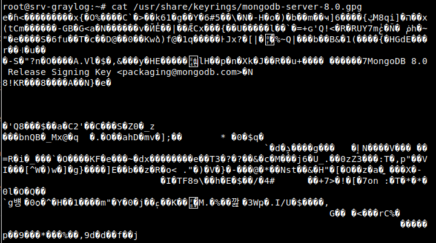

Dans les entreprises modernes, la gestion efficace des logs est cruciale pour assurer la sécurité et le bon fonctionnement de l'infrastructure informatique. Avec la multiplication des serveurs, applications, et périphériques réseau, les données de logs s’accumulent et deviennent difficiles à gérer. C’est ici qu'intervient Graylog, une solution open source conçue pour centraliser et analyser les logs de différentes sources en un seul endroit.

**Graylog** est un outil open source de gestion des logs, utilisé pour centraliser et gérer de grandes quantités de données de logs provenant de différentes sources dans les entreprises. Il comprend un serveur principal, qui reçoit les données de clients installés sur divers serveurs, et une interface web, permettant de visualiser ces données. En collectant les logs venant de sources comme les serveurs, les applications et les équipements réseau, Graylog donne aux équipes informatiques une vue d’ensemble sur leur infrastructure.

## Installaiton et configuration de graylog sur Debian 

### Installtion de MongoDB 

MongoDB est un système de base de données NoSQL qui stocke les données sous forme de documents. Il est conçu pour gérer de grandes quantités de données sans schéma fixe et peut être réparti sur plusieurs ordinateurs pour plus de flexibilité.

```bash
apt-get install gnupg
```

Installer curl si ce n'est pas fait : 


:::info 
La version de MongoDB que nous allons télécharger dans ce guide est la plus récente disponible au moment de sa rédaction. Pour obtenir la dernière version, vous pouvez visiter la [ documentation officielle ](https://www.mongodb.com/docs/manual/tutorial/install-mongodb-on-debian/).
:::

:::danger Attention
Si vous utilisez un proxy pour accéder à Internet, veillez à ajouter l'option **--proxy** dans vos commandes **curl** pour vous assurer que les requêtes passent correctement par le proxy. 

```bash
curl -fsSL --proxy "http://172.16.0.51:8080" https://www.mongodb.org/static/pgp/server-8.0.asc | gpg -o /usr/share/keyrings/mongodb-server-8.0.gpg --dearmor
```
:::

Si pas de proxy alors : 


```bash
curl -fsSL https://www.mongodb.org/static/pgp/server-8.0.asc | gpg -o /usr/share/keyrings/mongodb-server-8.0.gpg --dearmor
```

Vérifaction de l'ajout de la clé : 

```bash
ls -l /usr/share/keyrings/mongodb-server-8.0.gpg
```
```bash
cat /usr/share/keyrings/mongodb-server-8.0.gpg
```



Ajoute du dépôt MongoDB à la liste des sources APT sur Debian 

Pour Debian 12 : 

```bash
vim /etc/apt/sources.list.d/mongodb-org-8.0.list
```

Rajouter cette ligne :

```bash
echo "deb [ signed-by=/usr/share/keyrings/mongodb-server-8.0.gpg ] http://repo.mongodb.org/apt/debian bookworm/mongodb-org/8.0 main" | tee /etc/apt/sources.list.d/mongodb-org-8.0.list
```

```bash
apt-get update
```
```bash
apt-get install -y mongodb-org
```
Activer MongoDB au démarrage du système d'exploitation : 

```bash
systemctl daemon-reload
systemctl enable mongod.service
systemctl restart mongod.service
systemctl --type=service --state=active | grep mongod
```

:::info Optionelle

Sert à garder la version actuellement installée de MongoDB  sur votre système, empêchant toute mise à niveau automatique vers une version plus récente lors des futures mises à jour des paquets. (**mongodb-org**)

```bash
apt-mark hold mongodb-org
```
Pour annuler ce blocage :

```bash
sudo apt-mark unhold mongodb-org
```
:::

### Installation le noeud de données

Installer le paquet Data Node : 

:::danger Attention à l'Utilisation d'un Proxy 
* **Modifier le fichier `/etc/wgetrc`** :
   - Ouvrez le fichier de configuration `wget` avec votre éditeur de texte préféré :
     ```bash
     vim /etc/wgetrc
     ```
   - Recherchez les lignes concernant le proxy et ajoutez les informations appropriées. Par exemple :
     ```
     http_proxy = http://proxy.example.com:port/
     https_proxy = https://proxy.example.com:port/
     ```
   - Enregistrez les modifications et fermez le fichier.
:::

```bash
wget https://packages.graylog2.org/repo/packages/graylog-6.1-repository_latest.deb
dpkg -i graylog-6.1-repository_latest.deb
apt-get update
apt-get install graylog-datanode
```

Configurer vm.max_map_count pour une meilleure performance d'OpenSearch

Vérification et configuration de vm.max_map_count pour OpenSearch : 

Augmenter vm.max_map_count à 262144 permet d'assurer une gestion efficace de la mémoire par OpenSearch, évitant ainsi des erreurs liées aux mappages mémoire.

```bash
cat /proc/sys/vm/max_map_count
```

Exécutez la commande suivante pour appliquer les modifications de la configuration sans redémarrer le système :

```bash
sysctl -p
```

Création du password_secret : 

```bash
< /dev/urandom tr -dc A-Z-a-z-0-9 | head -c${1:-96};echo;
```

