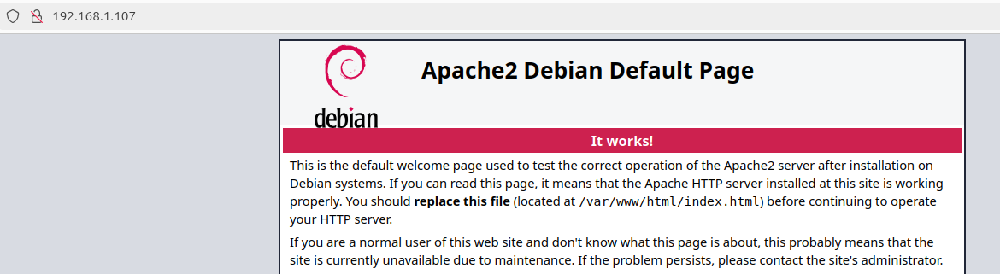
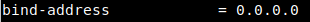
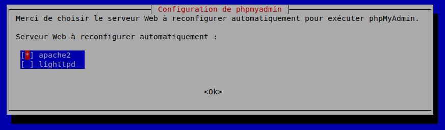
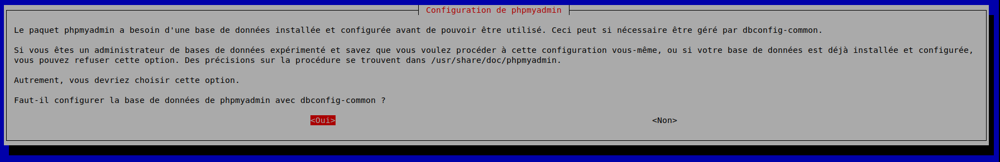
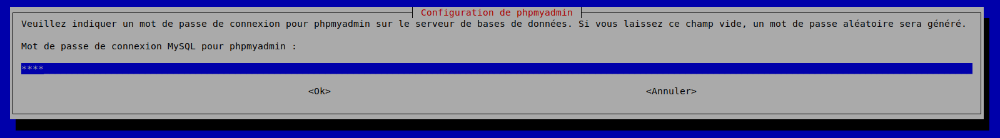
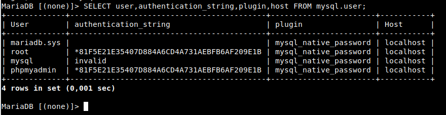
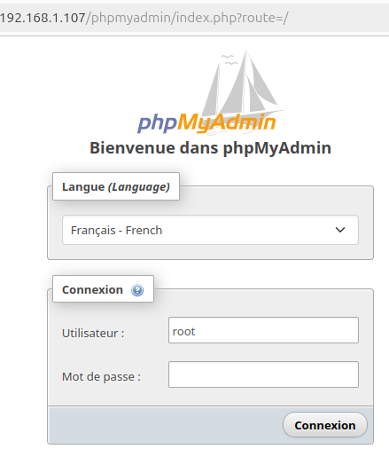

## Mise en place d’un serveur LAMP pour CMS

### Définition

Un **serveur LAMP** est un ensemble de logiciels qui crée un environnement permettant d’héberger des sites web et des applications dynamiques. LAMP est l’acronyme de :

* **Linux** : le système d’exploitation
* **Apache** : le serveur web
* **MySQL** : le système de gestion de bases de données
* **PHP** : le langage de programmation pour générer du contenu dynamique

#### Qu'est-ce qu'un CMS ?

Un **CMS (Content Management System)** ou système de gestion de contenu, est une application web qui permet aux utilisateurs de créer, gérer, et modifier du contenu sur un site web, sans nécessiter de compétences avancées en programmation. Ces plateformes facilitent la création et la gestion de sites dynamiques, car elles offrent des interfaces intuitives pour éditer du texte, ajouter des images, organiser des pages, et bien plus encore.

**Exemples de CMS populaires :**

- **WordPress** : Utilisé pour créer des blogs, des sites vitrines, et même des boutiques en ligne.
- **DokuWiki** : Un CMS léger, idéal pour gérer de la documentation de manière collaborative.
- **Joomla** et **Drupal** : D’autres CMS puissants, utilisés pour des sites plus complexes et personnalisables.

## Installation et Configuration du Serveur LAMP sur Debian 

:::danger Privilèges Administrateur Requis !
Les installations et manipulations décrites dans ce guide ont été effectuées avec des privilèges **root**. 
:::

### Installation d'apache 

On commence par mettre à jour les paquets avant de procéder à l'installation :

```bash
apt-get update
``` 
Ensuite, on installe le paquet **apache2** : 

```bash
apt-get install -y apache2
``` 

Pour que le service **Apache2** soit activé au démarrage du système, on utilise la commande suivante :

```bash
systemctl enable apache2
```
Accès a la page par défaut via l'ip du serveur : 

* la commande **ip a** permet de connaitre l'IP du serveur.

```bash
http://192.168.1.107
```


### Installation de MariaDB

Installation du paquet de MariaDB : 

```bash
apt-get install -y mariadb-server
```
Après l'installation de MariaDB, il est conseillé d'exécuter le script ci-dessus pour renforcer la sécurité de notre base de données afin de définir un mot de passe pour l'utilisateur root, désactiver l'accès à distance pour l'utilisateur root, empêcher les connexions anonymes et supprimer la base de test.

```bash
mariadb-secure-installation
```

```script
NOTE: RUNNING ALL PARTS OF THIS SCRIPT IS RECOMMENDED FOR ALL MariaDB
      SERVERS IN PRODUCTION USE!  PLEASE READ EACH STEP CAREFULLY!

In order to log into MariaDB to secure it, we'll need the current
password for the root user. If you've just installed MariaDB, and
haven't set the root password yet, you should just press enter here.

Enter current password for root (enter for none): 
OK, successfully used password, moving on...

Setting the root password or using the unix_socket ensures that nobody
can log into the MariaDB root user without the proper authorisation.

You already have your root account protected, so you can safely answer 'n'.

Switch to unix_socket authentication [Y/n] n
 ... skipping.

You already have your root account protected, so you can safely answer 'n'.

Change the root password? [Y/n] Y
New password: 
Re-enter new password: 
Password updated successfully!
Reloading privilege tables..
 ... Success!


By default, a MariaDB installation has an anonymous user, allowing anyone
to log into MariaDB without having to have a user account created for
them.  This is intended only for testing, and to make the installation
go a bit smoother.  You should remove them before moving into a
production environment.

Remove anonymous users? [Y/n] Y
 ... Success!

Normally, root should only be allowed to connect from 'localhost'.  This
ensures that someone cannot guess at the root password from the network.

Disallow root login remotely? [Y/n] Y
 ... Success!

By default, MariaDB comes with a database named 'test' that anyone can
access.  This is also intended only for testing, and should be removed
before moving into a production environment.

Remove test database and access to it? [Y/n] Y
 - Dropping test database...
 ... Success!
 - Removing privileges on test database...
 ... Success!

Reloading the privilege tables will ensure that all changes made so far
will take effect immediately.

Reload privilege tables now? [Y/n] Y
 ... Success!

Cleaning up...

All done!  If you've completed all of the above steps, your MariaDB
installation should now be secure.

Thanks for using MariaDB!
```
Test de connexion à la base de donées : 

```bash
mariadb -u root -p
```
<!-- 
### Configuration de MariaDB/MySQL pour accepter les connexion à distance : 
```bash
vim /etc/mysql/mariadb.conf.d/50-server.cnf
```
 

 -->

### Installation de PHP

Installation de php : 

```bash
apt-get install -y php
```
Nous installerons aussi des packages supplémentaires pour que le code PHP fonctionne avec Apache et qu'il puisse accéder à la base de données MySQL : 

```bash
apt-get install -y php-pdo php-mysql php-zip php-gd php-mbstring php-curl php-xml php-pear php-bcmath
```

:::info
À partir de cette étape, les instructions suivantes seront considérées comme optionnelles.
:::

Pour vérifier que notre moteur de script PHP fonctionne, nous allons créer un fichier nommé "phpinfo.php" (ou un autre nom) à la racine de notre site Web : 

```bash
vim /var/www/html/phpinfo.php
```
Et on va ajouter : 

```php
<?php
phpinfo();
?>
```
Après on ira voir la page à l'adresse suivante : 

```html
http://IP_serveur/phpinfo.php
```


### Installation de PHPMyAdmin

L'installation de PHPMyAdmin n'est pas obligatoire, mais elle facilite la gestion des bases de données avec une interface graphique intuitive.

Installation de PHPMyAdmin : 

```bash
apt install phpmyadmin
```

Choisissez d’utiliser PHPMyAdmin pour un serveur Apache : 



Lorsque vous êtes invité à utiliser dbconfig-common pour configurer la base de données, choisissez "Oui" : 



Pour le mot de passe root, il s’agit de celui que vous avez utilisé pour MariaDB : 



L'installation de phpMyAdmin ajoutera son fichier de configuration dans le répertoire /etc/apache2/sites-enabled/, où il sera automatiquement pris en compte. Il vous suffira ensuite d'activer l'extension PHP mbstring en utilisant la commande suivante :

```bash
phpenmod mbstring
```

Ensuite, vous devez redémarrer Apache :

```bash
systemctl restart apache2
```

### Configuration de l’accès par mot de passe pour le compte root dans MariaDB

```bash
systemctl restart apache2
```

Pour vous connecter à phpMyAdmin avec l’utilisateur root MySQL, vous devez changer la méthode d’authentification de auth_socket à mysql_native_password si vous ne l’avez pas déjà fait. Pour ce faire, ouvrez une ligne de commande MySQL via un terminal:

```bash
mysql
```
Après, avec la commande suivante, il faut vérifier quelle méthode d’authentification de vos comptes d’utilisateur MariaDB utilise:

```MariaDB
SELECT user,authentication_string,plugin,host FROM mysql.user;
```


L’utilisateur root n'utilise pas la méthode d’authentification en utilisant le plugin auth_socket. **Dans le cas contraire pour configurer l’authentification par mot de passe pour le compte de root, exécutez la commande ALTER USER** : 

```MariaDB
ALTER USER 'root'@'localhost' IDENTIFIED WITH mysql_native_password BY 'MyPass';
```

Pour appliquer les modification, exécutez la commande FLUSH PRIVILEGES:

```MariaDB
FLUSH PRIVILEGES;
```
Vérifiez les méthodes d’authentification pour confirmer que l’utilisateur de root n’utilise plus le plug-in auth_socket:

```MariaDB
 SELECT user,authentication_string,plugin,host FROM mysql.user;
 ```

 Vous pouvez désormais accéder à l’interface web en tapant le nom de domaine ou l’adresse IP publique de votre serveur et en ajoutant /phpmyadmin :

 ```MariaDB
http://IP_SERVEUR/phpmyadmin/index.php 
```



:::danger
**Utilisation de l'utilisateur root**

J’ai utilisé un utilisateur root, mais il vaut mieux créer un utilisateur séparé ! Vous devez également configurer le fichier `.htaccess` pour augmenter la sécurité.
:::


🎉 **Le serveur est maintenant prêt !** 🚀  

