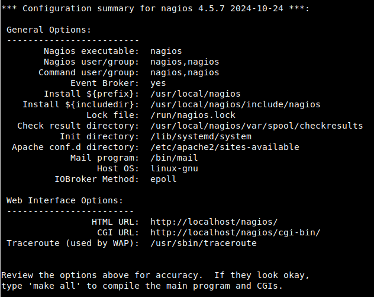
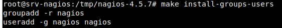
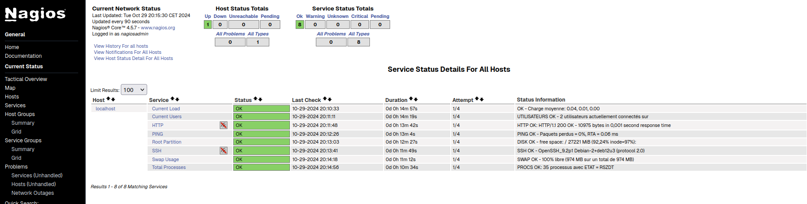
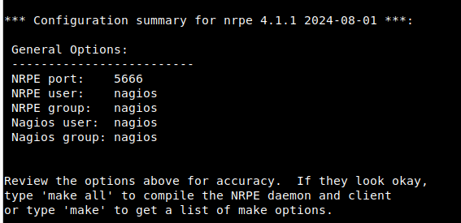
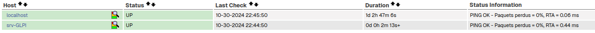
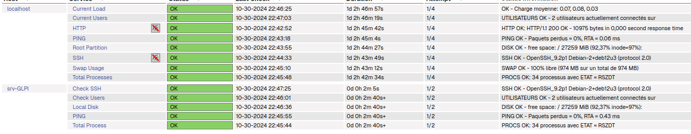

## Introduction à Nagios

Nagios Core est un logiciel de surveillance open-source, sous licence GNU-GPL, qui permet de surveiller l'état des systèmes, des réseaux et des infrastructures informatiques. Il est conçu pour alerter les administrateurs lorsqu'un service ou un hôte ne fonctionne pas correctement, ce qui est crucial pour assurer la disponibilité et la performance des systèmes. Nagios peut fonctionner nativement sur des systèmes de type Unix, mais peut également être utilisé sur des systèmes d'exploitation Windows via un logiciel de machine virtuelle.

#### Fonctionnalités clés de Nagios

1. **Surveillance des équipements** : Permet de surveiller divers dispositifs tels que serveurs, routeurs et commutateurs via des protocoles comme ICMP et SNMP.

2. **Surveillance des services** : Assure le suivi des services critiques (HTTP, SMTP, FTP, etc.) pour garantir leur disponibilité.

3. **Alertes et notifications** : Envoie des alertes en temps réel aux administrateurs en cas d'incidents, via e-mail, SMS ou autres canaux.

4. **Surveillance active et passive** : Utilise des méthodes actives pour interroger les dispositifs et des méthodes passives pour recevoir des données des équipements.

5. **Extensibilité avec des plugins** : Supporte des plugins personnalisés pour surveiller des services ou dispositifs spécifiques selon les besoins.

:::info Prérequis
Pour mener à bien ce tutoriel, assurez-vous de disposer des éléments suivants :

- **Serveur Web :** Apache
- **PHP**
- **Plugins Nagios :** Un ensemble de plugins Nagios pour la surveillance des services.
:::

## Installation de Nagios 

:::danger Attention
Dans ce guide, nous allons installer **Nagios Core**, qui est la version gratuite du logiciel. Veuillez ne pas installer Nagios XI, la version payante, car ce tutoriel se concentre uniquement sur Nagios Core.
:::

Mise à jour des paquets sur la machine Debian : 

```bash
apt-get update && apt-get upgrade
```
Installation des dépendances Nagios ( tout les paquets réquis ) :

```bash
apt install -y build-essential apache2 php openssl perl make php-gd libgd-dev libapache2-mod-php libperl-dev libssl-dev daemon wget apache2-utils unzip
```

On télécharge les fichiers d’installation de Nagios Core :

:::danger Attention à l'utilisation d'un proxy
Avant d'installer l'archive de Nagios, il est crucial de vérifier si votre organisation utilise un proxy pour les connexions Internet. Si tel est le cas, vous devez configurer votre fichier de configuration `wget` pour référencer le proxy de l'organisation.

* Modifiez le fichier `/etc/wgetrc` :
   - Ouvrez le fichier de configuration `wget` avec votre éditeur de texte préféré :

   ```bash
   vim /etc/wgetrc
   ```
:::

:::info
La version de Nagios Core que nous allons déployer dans ce guide est celle la plus récente disponible au moment de sa rédaction. Pour obtenir la dernière version de Nagios Core, vous pouvez visiter les dépôts de [releases sur GitHub](https://github.com/NagiosEnterprises/nagioscore/releases) ou consulter [le site officiel de Nagios](https://assets.nagios.com/downloads/nagioscore/versions.php).
:::

```bash
cd /tmp
```

```bash
wget https://github.com/NagiosEnterprises/nagioscore/releases/download/nagios-4.5.7/nagios-4.5.7.tar.gz
```

Décompression du fichier téléchargé :

```bash
tar -zxvf nagios-4.5.7.tar.gz
```
Exécution du script de configuration de Nagios Core : 

```bash
cd /tmp/nagios-4.5.7/
```

```bash
./configure
```


Compilation du programme et des interfaces web (CGI) :

```bash
make all
```

Création d’un groupe et d'un utilisateur :

```bash
make install-groups-users
```


Installation et Configuration de Nagios avec les Commandes Suivantes : 

```bash
make install
make install-init
make install-commandmode
make install-config
make install-webconf
a2enmod rewrite
a2enmod cgi
```
###  Activation de la Surveillance des Serveurs Distants dans nagios.cfg : 

Pour permettre à Nagios de surveiller les serveurs distants, il est nécessaire de modifier le fichier de configuration nagios.cfg en supprimant le commentaire de la ligne suivante : 


```bash
vim /usr/local/nagios/etc/nagios.cfg
```

```bash
cfg_dir=/usr/local/nagios/etc/servers
```
Puis, créez un répertoire serveur : 

```bash
mkdir -p /usr/local/nagios/etc/servers
```

On redémarre le service Apache :

```bash
systemctl restart apache2
```

Création du Mot de Passe Administrateur pour l'Interface Web de Nagios : 

```bash
htpasswd -c /usr/local/nagios/etc/htpasswd.users nagiosadmin
```

### Installation des plugins Nagios : 

:::info
La version des plugins Nagios que nous allons télécharger dans ce guide est la plus récente disponible au moment de sa rédaction. Pour obtenir les derniers plugins, vous pouvez visiter lles dépôts de [ releases sur GitHub](https://github.com/nagios-plugins/nagios-plugins/releases).

:::

```bash
cd /tmp
wget https://github.com/nagios-plugins/nagios-plugins/releases/download/release-2.4.12/nagios-plugins-2.4.12.tar.gz
```
Extraction des plugins téléchargés :

```bash
tar -zxvf nagios-plugins-2.4.12.tar.gz
```
Exécutions du script de configuration du plugin :  

```bash
cd nagios-plugins-2.4.12/                      
./configure --with-nagios-user=nagios --with-nagios-group=nagios
```
Compilation des plugins Nagios Core : 

```bash
make
```
Installation des plugins : 

```bash
make install
```

Vérification de la présence des plugin dans le dossier libexec : 

```bash
ls /usr/local/nagios/libexec/
```

Vérification de la configuration :

```bash
/usr/local/nagios/bin/nagios -v /usr/local/nagios/etc/nagios.cfg
```

Activation du service Nagios pour permettre l'éxecutions au démarrage du système : 

```bash
systemctl enable nagios
```

On lance le service Nagios : 

```bash
systemctl start nagios
```
Accès à l'Interface Web de Nagios via un Navigateur : 

**Login pour se connecter :**
   * id : nagiosadmin 
   * mdp : celui saisi précédemment

```bash
http://IP_serveur/nagios
```




## Configuration des Plugins de Surveillance à Distance

:::info
- **NRPE (Nagios Remote Plugin Executor)** : pour la surveillance des systèmes Linux/Unix.
- **NSClient++** : pour la surveillance des serveurs Windows.
:::

### NRPE (Nagios Remote Plugin Executor)

NRPE est un plugin qui permet d'exécuter des commandes à distance sur des serveurs Linux/Unix via Nagios. Il aide à surveiller divers aspects du système, tels que :
- **Utilisation CPU** : vérifie la charge du processeur.
- **Utilisation mémoire** : contrôle l'utilisation de la mémoire système.
- **Espace disque** : surveille l'espace disponible sur les disques.
- **État des processus** : vérifie si des processus spécifiques sont actifs.

### NSClient++

NSClient++ est un agent conçu pour la surveillance des systèmes Windows et permet au serveur Nagios de récupérer des données importantes sur les performances du système, telles que :
- **État des services Windows** : s'assure que les services critiques sont en cours d'exécution.
- **Surveillance des processus** : vérifie l'état et l'utilisation des processus.
- **Utilisation des ressources système** : collecte des informations sur l'utilisation du CPU, de la mémoire et du disque.
- **Logs d'événements** : permet de surveiller les logs d'événements pour détecter les erreurs ou avertissements.

### Installation et configuration de NRPE sur le serveur Nagios

```bash
cd /tmp
```
:::info
La version des plugins Nagios que nous allons télécharger dans ce guide est la plus récente disponible au moment de sa rédaction. Pour obtenir les derniers plugins, vous pouvez visiter les dépôts de [ releases sur GitHub](https://github.com/NagiosEnterprises/nrpe/releases).

:::

```bash
wget --no-check-certificate -O nrpe.tar.gz https://github.com/NagiosEnterprises/nrpe/releases/download/nrpe-4.1.1/nrpe-4.1.1.tar.gz
```

```bash
tar -zxvf nrpe.tar.gz
```

Compilation du code source : 

```bash
cd nrpe-4.1.1/
```

```bash
./configure --enable-command-args --with-ssl-lib=/usr/lib/x86_64-linux-gnu/
```
Résumer de la configuration :



Finalisation de l'Installation : (Création des Groupes, Utilisateurs et Installation des Fichiers)

```bash
 make all
 make install-groups-users  # si sa na pas été fait auparavant
 make install
 make install-config
```
Mise à Jour des Fichiers de Services : Configuration du Port pour Nagios et NRPE : 

:::info
Pour éxécuter ces commendes il faut des droit admin
:::

```bash
 sh -c "echo >> /etc/services" 
 sh -c "echo '# Nagios services' >> /etc/services"
 sh -c "echo 'nrpe 5666/tcp' >> /etc/services"
```
Installation du service daemon : 

```bash
 make install-init
 systemctl enable nrpe.service
```
Modification du Fichier de Configuration NRPE :

Pour permettre au serveur Nagios d'accéder au service NRPE sur l'hôte, modifiez le fichier de configuration `nrpe.cfg` et ajoutez l'adresse IP du serveur Nagios à la liste des hôtes autorisés.

Ouvrez le fichier de configuration NRPE avec un éditeur de texte :

```bash
 vim /usr/local/nagios/etc/nrpe.cfg
```
Trouvez la ligne commençant par allowed_hosts et ajoutez l'adresse IP de votre serveur Nagios après 127.0.0.1. Par exemple :

```bash
 allowed_hosts=127.0.0.1,10.25.5.2
```

Modification de la variable **dont_blame_nrpe** :

Ensuite, pour permettre aux clients de spécifier des arguments dans les commandes NRPE, modifiez la valeur de `dont_blame_nrpe` à `1`.

```bash
 dont_blame_nrpe=1
```

Ce changement active les arguments de commande, permettant des configurations NRPE plus avancées.

Vérification des Commandes NRPE :

**Assurez-vous que les commandes NRPE ne sont pas commentées :**  
   Dans le fichier `/etc/nagios/nrpe.cfg`ou `/usr/local/nagios/etc/nrpe.cfg` certaines commandes de vérification doivent être actives pour permettre la surveillance des services de base.

   - Ouvrez le fichier de configuration :

     ```bash
     vim /usr/local/nagios/etc/nrpe.cfg
     ```

   - Vérifiez que les lignes suivantes ne sont pas commentées (c'est-à-dire sans le caractère `#` au début) :
     ```bash
     command[check_users]=/usr/local/nagios/libexec/check_users -w 5 -c 10 
     command[check_load]=/usr/local/nagios/libexec/check_load -r -w .15,.10,.05 -c .30,.25,.20 
     command[check_hda1]=/usr/local/nagios/libexec/check_disk -w 20% -c 10% -p /dev/hda1 
     command[check_zombie_procs]=/usr/local/nagios/libexec/check_procs -w 5 -c 10 -s Z 
     command[check_total_procs]=/usr/local/nagios/libexec/check_procs -w 150 -c 200
     ```

   Ces commandes sont utilisées pour surveiller les services de base comme les utilisateurs, la charge du système, l’espace disque, les processus zombies, et le nombre total de processus.

Lancement de daemon NRPE :

```bash
 systemctl start nrpe
```
```bash
 systemctl enable nrpe
```
```bash
systemctl status nrpe
```

En cas de problème vérifier le journal des logs :

```bash
journalctl -xe -u nrpe
```
Création du fichier de configuration définissant la machines et les services à surveiller : 

```bash
vim /usr/local/nagios/etc/servers/GLPI.cfg
```
    - On va commencer par définir l'hôte à surveiller : 
    
    ```bash
     # Nagios Host configuration file template
        define host {
            use                          linux-server
            host_name                    mtr-ubuntu
            alias                        Ubuntu Host
            address                      192.168.1.6
            register                     1
        }
    ```
    - Puis on rajoute les differents service à surveiller : 

        ```bash
                    define service {
            host_name                       mtr-ubuntu
            service_description             PING
            check_command                   check_ping!100.0,20%!500.0,60%
            max_check_attempts              2
            check_interval                  2
            retry_interval                  2
            check_period                    24x7
            check_freshness                 1
            contact_groups                  admins
            notification_interval           2
            notification_period             24x7
            notifications_enabled           1
            register                        1
        }

        define service {
            host_name                       mtr-ubuntu
            service_description             Check Users
            check_command           check_local_users!20!50
            max_check_attempts              2
            check_interval                  2
            retry_interval                  2
            check_period                    24x7
            check_freshness                 1
            contact_groups                  admins
            notification_interval           2
            notification_period             24x7
            notifications_enabled           1
            register                        1
        }

        define service {
            host_name                       mtr-ubuntu
            service_description             Local Disk
            check_command                   check_local_disk!20%!10%!/
            max_check_attempts              2
            check_interval                  2
            retry_interval                  2
            check_period                    24x7
            check_freshness                 1
            contact_groups                  admins
            notification_interval           2
            notification_period             24x7
            notifications_enabled           1
            register                        1
        }

        define service {
            host_name                       mtr-ubuntu
            service_description             Check SSH
            check_command                   check_ssh
            max_check_attempts              2
            check_interval                  2
            retry_interval                  2
            check_period                    24x7
            check_freshness                 1
            contact_groups                  admins
            notification_interval           2
            notification_period             24x7
            notifications_enabled           1
            register                        1
        }

        define service {
            host_name                       mtr-ubuntu
            service_description             Total Process
            check_command                   check_local_procs!250!400!RSZDT
            max_check_attempts              2
            check_interval                  2
            retry_interval                  2
            check_period                    24x7
            check_freshness                 1
            contact_groups                  admins
            notification_interval           2
            notification_period             24x7
            notifications_enabled           1
            register                        1
        }

        ```

## Installation et configuration de NRPE sur une cliente/serveur Debian

installation de  NRPE : 
 
```bash
apt update
```

```bash
apt install nagios-nrpe-server nagios-plugins
```
Cette commande installera nagios-nrpe-server pour exécuter les commandes NRPE et les plugins Nagios de base pour les vérifications.

Configuration de nrpe.cfg pour définir a qui envoyer les données (le serveur ) : 

```bash
vim /etc/nagios/nrpe.cfg
```
```bash
allowed_hosts=127.0.0.1,IP_serveur
```
```bash
systemctl restart nagios-nrpe-server
```
### Vérificaiton de la connectivité entre le serveur et l'hôte à surveiller

Vérification de la connexion NRPE depuis le serveur Nagios:

```bash
/usr/local/nagios/libexec/check_nrpe -H <ip_machine>
```

La réponse **NRPE v4.1.0** indique que le service NRPE est correctement installé et fonctionne sur la machine distante.

Vérification de la configuration coté serveur Nagios: 

```bash
/usr/local/nagios/bin/nagios -v /usr/local/nagios/etc/nagios.cfg
```


```bash
service apache2 restart
```


```bash
service nagios restart
```

Vérificaiton de la présence du serveur à surveiller : 

 - Dans host :
    

 - Dans services

    